# maven使用简单介绍

官网：[http://maven.apache.org/](http://maven.apache.org/)

详细教程：[https://www.w3cschool.cn/maven/](https://www.w3cschool.cn/maven/)


### 简单使用maven做什么？
* 构建不依赖于IDE的标准化项目（导入IDE只需要以maven项目导入即可）
* 目录结构统一并且简单，约定大于配置，被其他构建工具以及项目广泛采用
* 统一对项目依赖的jar包进行管理，明确jar包依赖以及对应的版本自动下载等（[细节请看详细教程](https://www.w3cschool.cn/maven/)）


### maven的下载安装
1. **下载**  
进入[官网](http://maven.apache.org/)选择download菜单进入下载页面  
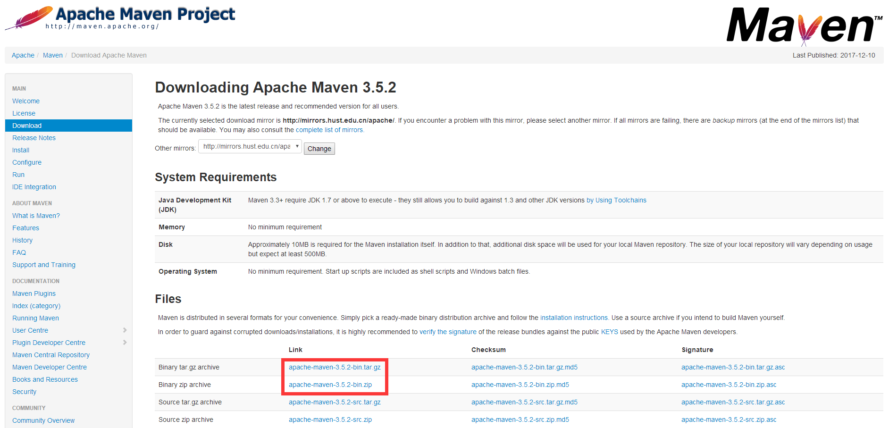  
tar.gz文件对应linux系统  
zip文件对应windows系统

2. **安装**  
解压即可使用  
对于在windows下使用maven，如果需要使用cmd执行命令的话，需要在path环境变量中添加maven/bin目录即可，使用IDE并不需要配置环境变量等  
推荐目录结构如下：  
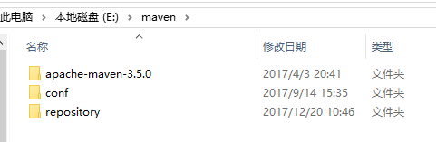  
第一个为解压后的文件目录  
第二个用来作为maven的全局文件（settings.xml）存放目录（IDE中需要在maven配置中指向此文件才会生效，日后更换maven版本只需要更换原来的maven解压路径即可，不必再做配置）  
第三个用来作为maven下载jar包的本地仓库存放目录（需要在settings.xml配置文件中指定，不然存放到默认路径C盘中，不方便管理与查找）  

3. **配置**  
在解压的文件目录下进入conf文件夹，其中有默认的settings.xml配置文件  
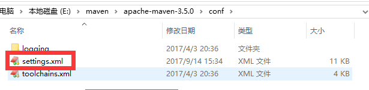  
配置文件一般只需要配置2个地方，一个是下载jar包的本地仓库存放目录，另外一个为下载jar包的国内镜像地址（默认地址为国外，速度较慢）  
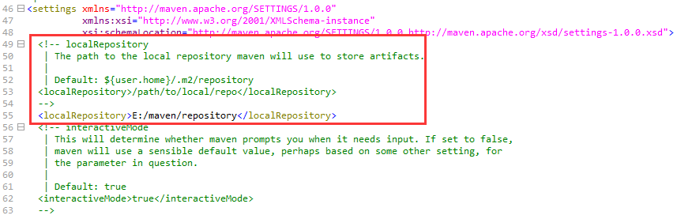  
从默认的注释中复制出来，配置上前面定好的本地仓库存放目录，如果不配置则会存放到注释中默认指向地址${user.home}/.m2/repository  
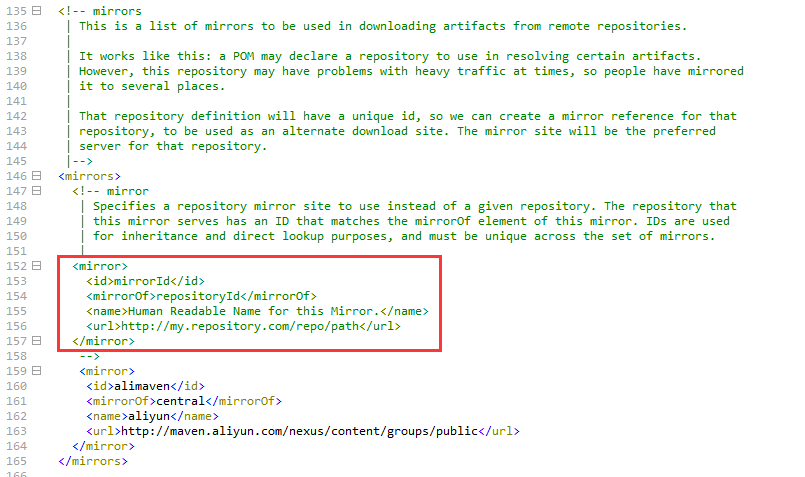  
依旧从默认的注释中复制镜像出来，id与name可以随意起名，mirrorOf为central则说明是中央仓库，URL推荐填写阿里云maven仓库地址 [http://maven.aliyun.com/nexus/content/groups/public](http://maven.aliyun.com/nexus/content/groups/public)  
之后保存，复制出一份存放在前面设置的maven全局文件存放目录下面（当替换maven版本时，内置的配置文件使用IDE设置好全局文件时可不用更改，更换maven版本也只是解压新版本后在IDE中设置新的maven安装路径就完成了）  


### IDE中配置maven
1. **MyEclipse**  
点击导航栏window进入preferences搜索maven  
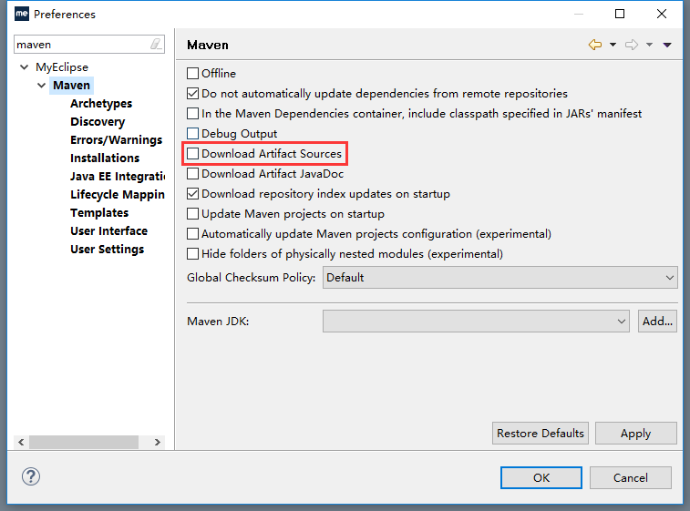  
建议勾选Download Artifact Sources（下载jar包的同时下载源码，方便直接点方法进源码查看）  
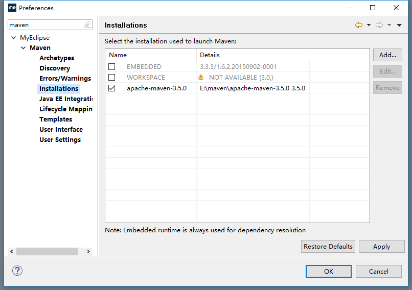  
添加安装的maven  
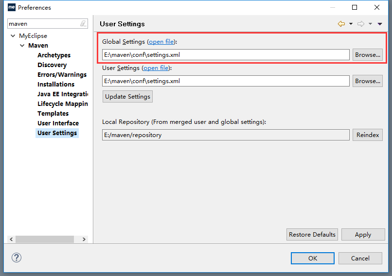  
设置好maven的全局配置文件路径（本地仓库存放目录自动扫描文件中的目录）  
至此完成了MyEclipse中maven的配置  

2. **IDEA**  
不要在打开项目的时候选择file/settings，那样设置完只会针对当前项目，若打开了项目，则选择file/Close Project关闭项目回退到初始idea界面
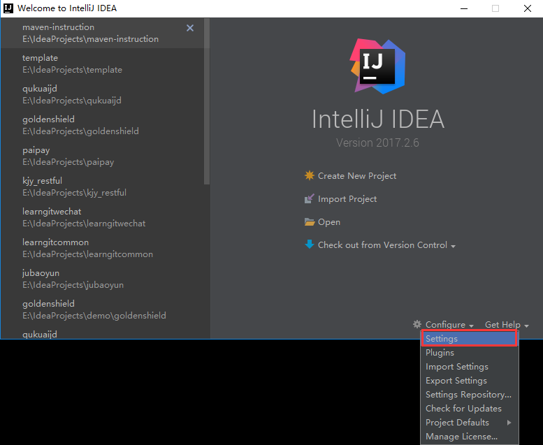  
指定好maven的安装目录以及配置文件位置  
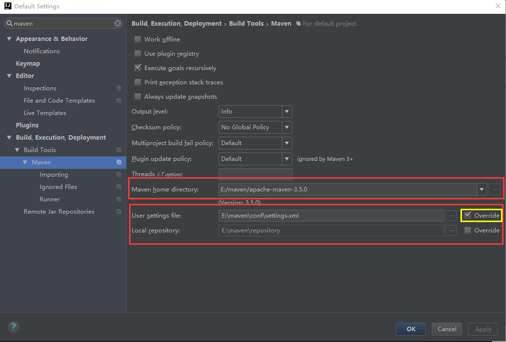  
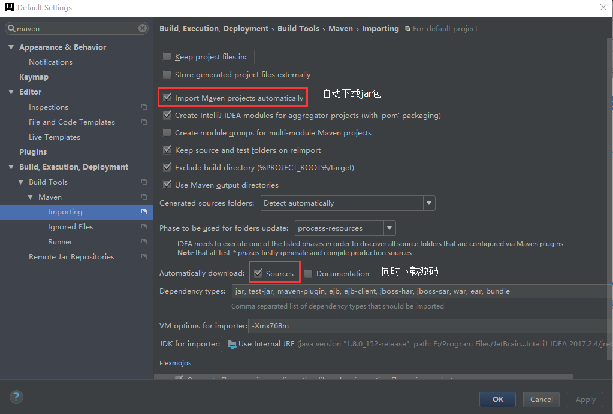  
至此完成了idea中的maven的配置


### 创建一个maven的java web项目
1. **MyEclipse**  
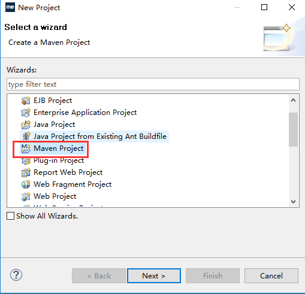  
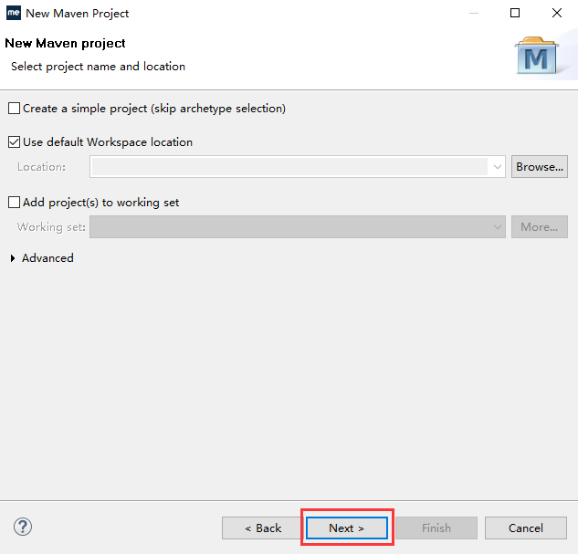  
选取项目模板java web项目为maven-archetype-webapp  
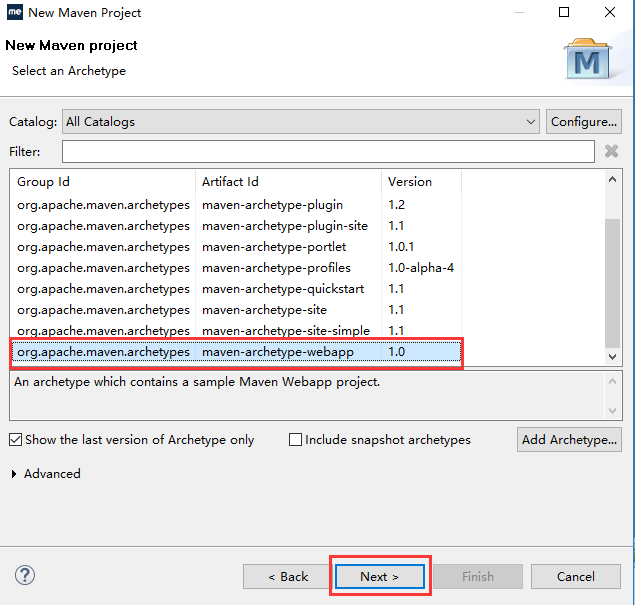  
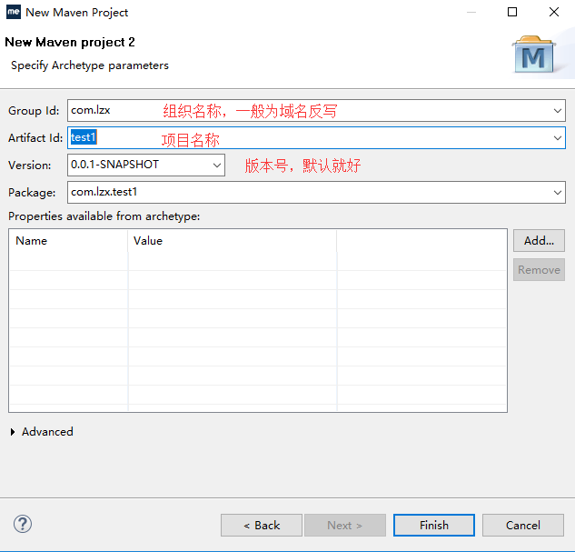  
finish完成创建，第一次创建时需要下载一些jar包，会慢一点，至此就创建完毕了  

2. **IDEA**  
新建项目
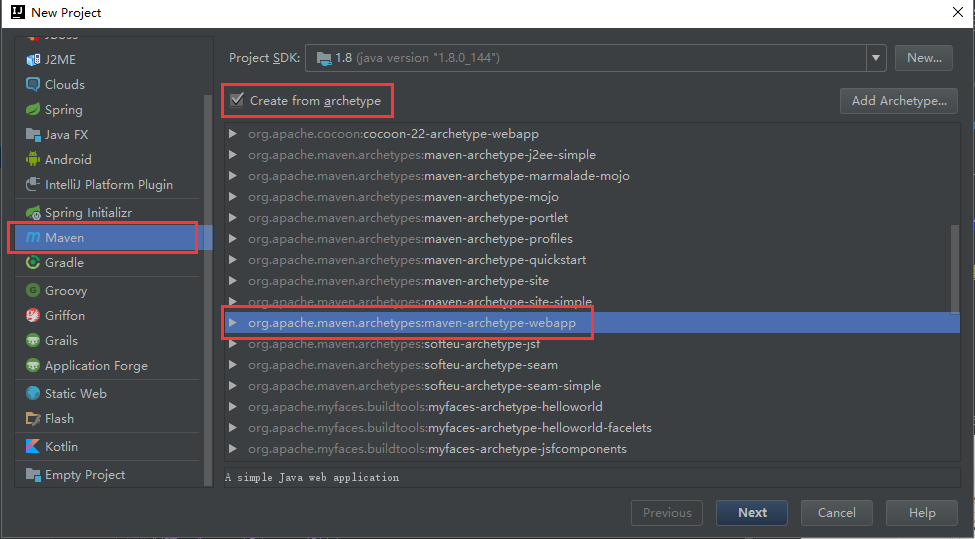  
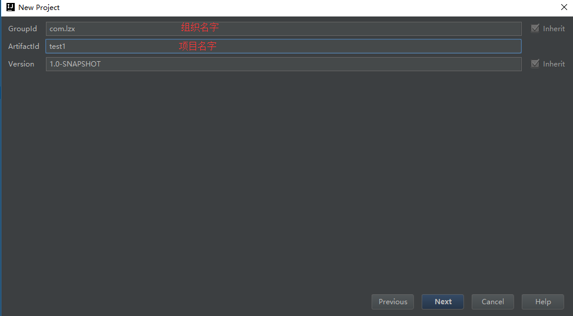  
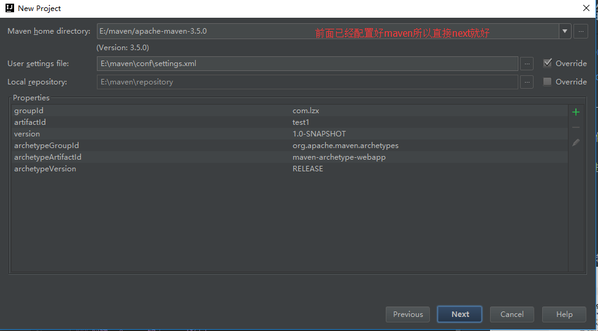  
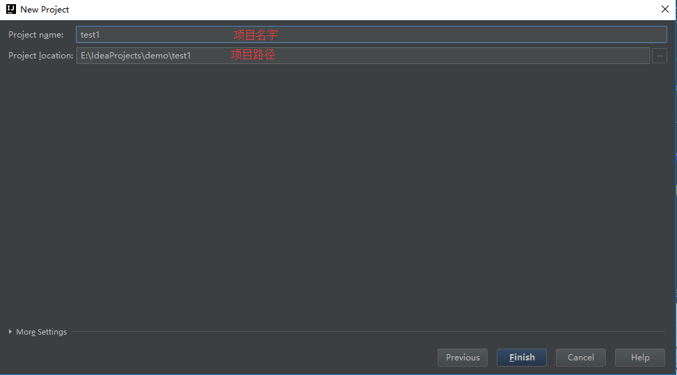  
finish完成创建，第一次创建时需要下载一些jar包，会慢一点，至此就创建完毕了  


### maven的java web项目的目录结构
[pom.xml项目配置文件例子](pom.xml)  
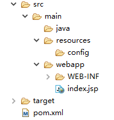  
```
project
│   pom.xml（maven项目配置文件）
│
└───src（源码根目录）
│   │
│   └───main（源码主目录）
│   │   │
│   │   └───java（java源码目录）
│   │   │   │
│   │   │   └───xxx（项目包名）
│   │   │   └───sql（包名，有清空数据库在java源码目录下同级放置）
│   │   │
│   │   └───resources（源码所使用的资源文件目录，存放配置文件）
│   │   │   │
│   │   │   └───config（配置文件）
│   │   │        │
│   │   │        └───jdbc
│   │   │        └───mybatis
│   │   │        └───spring
│   │   │
│   │   └───webapp（web文件目录，等同于WebRoot）
│   │   │
│   │
│   └───test（测试目录，测试用例等，小项目暂未使用）
│        │   xxxTest.java
│        │   ...
│    
└───target（maven项目默认编译输出目录，自动生成）
     │   ...
```  
1. java源码目录使用模板生成没有此文件夹，自行创建并设置为源码目录，MyEclipse设置方式为文件夹右键Build Path/Use as Source Folder，idea为右键Make Directory as/Sources Root
2. resources资源文件目录在导入maven项目时此文件夹为普通文件夹，需要IDE设置为资源文件夹，MyEclipse设置方式同上，idea为右键Make Directory as/Resources Root
